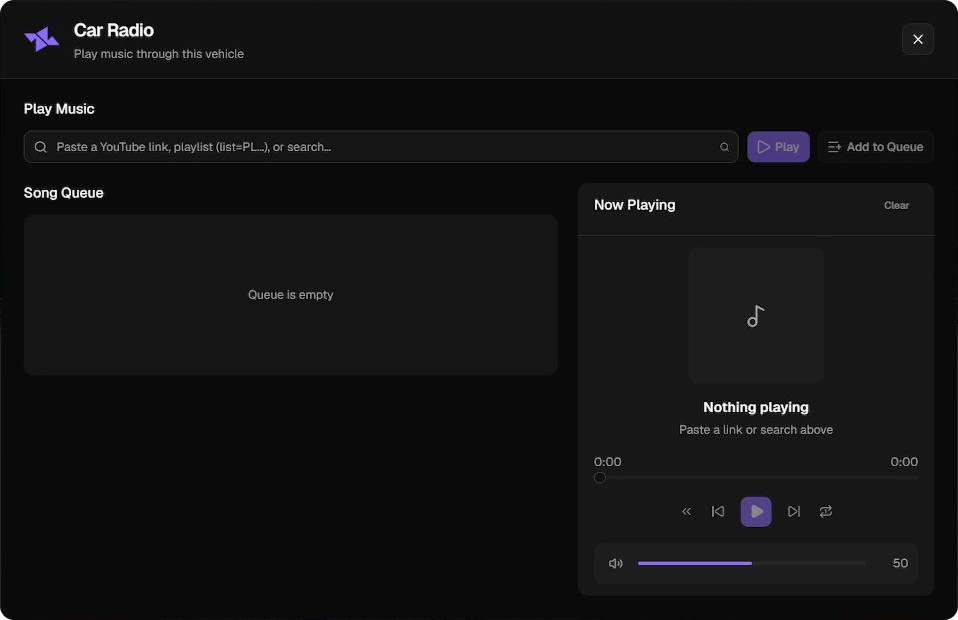

# bd_carradio

Vehicle radio for FiveM that plays **YouTube** audio with real **3D positional sound** — distance falloff, HRTF panning, and cabin muffling. Uses the **YouTube Data API** for search and metadata, and YouTube's streaming endpoints (resolved server-side) for Web Audio playback.



## Features

- **Search** YouTube by name or paste a link (watch, Shorts, `youtu.be`, Music)
- **Queue** up to 25 tracks per vehicle with play, skip, seek, and volume
- **Playlists** — saved playlists (`list=PL...`) load in order; first track plays, the rest queue behind it
- **True 3D audio** — outside listeners hear direction and distance; open doors and broken windows affect muffling
- **Occupants** hear the stereo directly (no ear-flicker from an HRTF panner on top of them)
- **Blocklist** — ban specific video ids or words in titles and channel names
- **HTTPS streaming** — serve proxied audio from your own reverse proxy for 3D panning (recommended)
- **Passenger control** — configurable; driver-only mode supported
- **View-only mode** — passengers without control still hear nearby radios

## Requirements

- FiveM artifact with **Lua 5.4**
- A **YouTube Data API v3** key with the YouTube Data API enabled (`config.youtubeApiKey`)
- Outbound HTTPS from the game server (`googleapis.com`, `youtube.com`, `googlevideo.com`)
- An **HTTPS reverse proxy** pointing at this resource's HTTP handler (for 3D panning — see below)

## Installation

1. Place the resource in your server `resources` folder as `bd_carradio` (or any name you prefer).
2. Set your YouTube Data API key in `shared/config.lua`:

```lua
youtubeApiKey = 'YOUR_API_KEY_HERE',
```

3. Set up HTTPS streaming (required for 3D panning) — see [HTTPS streaming](#https-streaming) below.
4. Add to `server.cfg`:

```cfg
ensure bd_carradio
```

5. Restart the server. You should see `[binary-radio] ready` in the console.

## HTTPS streaming

Browsers inside FiveM's NUI require **HTTPS** audio URLs with CORS headers for Web Audio 3D panning. The resource exposes a built-in HTTP handler at `/stream/{videoId}` that proxies YouTube audio with the correct headers.

Point a reverse proxy (nginx, Caddy, etc.) at your FXServer HTTP port and set `config.audioUrl` to that public HTTPS URL:

```lua
audioUrl = 'https://radio.yourserver.com',
```

Without `audioUrl`, audio falls back to the game connection (slower, no seeking over HTTPS, but 3D panning still works via blob URLs).

## Usage

| Input | Action |
|--------|--------|
| `/carradio` or default key **G** | Open the radio while in a vehicle |
| YouTube link or video id | Play immediately |
| `list=PL...` playlist link | Play first track, queue the rest in order |
| Anything else | Search YouTube, pick a result |

**Live streams** are rejected (no fixed duration). Tracks longer than `config.maxSongMinutes` are refused.

### Playlists vs mixes

| Link type | Example | Behaviour |
|-----------|---------|-------------|
| **Saved playlist** | `list=PL...` | Exact track list and order |
| **YouTube Mix / Radio** | `list=RD...` | Algorithmic mix — may not match what you see in the YouTube app |
| **Watch Later / Liked** | `list=WL`, `list=LM...` | Not supported (requires OAuth) |

## Configuration

Main options in `config.lua`:

| Option | Description |
|--------|-------------|
| `youtubeApiKey` | YouTube Data API v3 key |
| `audioUrl` | Public HTTPS URL proxying this resource's `/stream` endpoint |
| `command` | Chat command to open the panel (default: `carradio`) |
| `keybind` | Default keybind (default: `G`) |
| `permission` | ACE permission to control the radio; empty = everyone |
| `passengersCanControl` | Allow non-drivers to change music (default: `true`) |
| `hearingDistance` | How far away music can be heard, in metres (default: `24`) |
| `outsideVolume` | Outside volume relative to inside (default: `0.7`) |
| `maxSongMinutes` | Refuse tracks longer than this (default: `15`) |
| `queueSize` | Max queued tracks per vehicle (default: `25`) |
| `searchResults` | How many search results to show (default: `24`) |
| `maxPlaylistTracks` | Max tracks loaded from a playlist (default: `50`) |
| `blockedSongs` | List of video ids to block |
| `blockedWords` | Words in titles/channels to block |

## How 3D audio works

The YouTube IFrame Player cannot be routed through Web Audio's `PannerNode` (cross-origin restriction). Instead, the server resolves a direct audio stream URL via YouTube's internal player API and proxies it. The NUI loads that audio into an `HTMLAudioElement` connected to a Web Audio graph with HRTF panning, lowpass filtering, and cabin muffling.

## API quota

Each search costs ~100 quota units, each video lookup costs ~1 unit. The default daily quota is 10,000 units.

## Building the UI

```bash
cd web
npm install
npm run build
```
